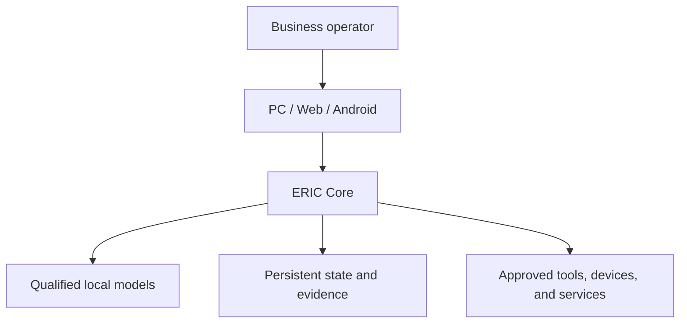

# ERIC

## A Private AI Operating Environment

ERIC stands for **Execution, Reasoning, Integration, and Control**.

ERIC is a local-first intelligence and control system built for a simple premise: a language model by itself is not a dependable operating system for real work.

A model can generate an answer. ERIC supplies the structure around that answer: persistent state, evidence, routing, memory, authority, execution boundaries, verification, recovery, diagnostics, and first-party interfaces.

## The Product in One Sentence

ERIC is installed inside a customer's environment as that customer's private AI system, then maintained as a managed technical service.

The customer owns its data, hardware, and business-specific configuration. The ERIC provider retains ownership of the ERIC core, source, architecture, and reusable operating methods.

## What Makes It Different

| Question | ERIC's job |
| --- | --- |
| Can the system answer? | Route work only to models qualified for the needed capability. |
| Is it ready? | Separate process liveness from real operational readiness. |
| Can it act? | Require explicit, bounded authority before tool or device execution. |
| Did it work? | Verify the observable result instead of trusting a model's statement. |
| What happens after a crash? | Reopen durable state and check before repeating work. |
| Who owns the truth? | Keep Core authoritative across PC/Web and Android. |
| What remains unknown? | Preserve unknown, partial, and failed states instead of calling them success. |

## Operating Model

ERIC Core is the system of record. The model, user interface, and external tools are components around that core; none independently gets to redefine truth or execution authority.

## Deployment Model

Initial deployments are private and single-customer:

1. Install ERIC inside the customer's approved environment.
2. Connect only approved data, workflows, tools, users, and devices.
3. Configure permissions and evidence boundaries.
4. Qualify the models and workflows needed for that deployment.
5. Maintain the software, models, backups, diagnostics, recovery, and upgrades.

Shared multi-tenant hosting is a later problem. It demands stronger isolation, security, billing, support, and operational infrastructure than a private deployment.

## Public Versus Private

This repository may include architecture, diagrams, operating concepts, selected evidence summaries, and safe screenshots.

It does not include production source code, credentials, customer data, operator records, private bridge state, machine-specific execution paths, deployment secrets, or private diagnostic logs.

## Project Position

ERIC is an active engineering system. Public claims are restricted to what can be supported by source and acceptance evidence. Product direction and future work are labeled separately from implemented capability.

## Licensing

ERIC is proprietary software. Customer deployments receive a limited deployment license and maintenance service; they do not receive ownership of the ERIC core.

For business or deployment inquiries, contact information is forthcoming.
